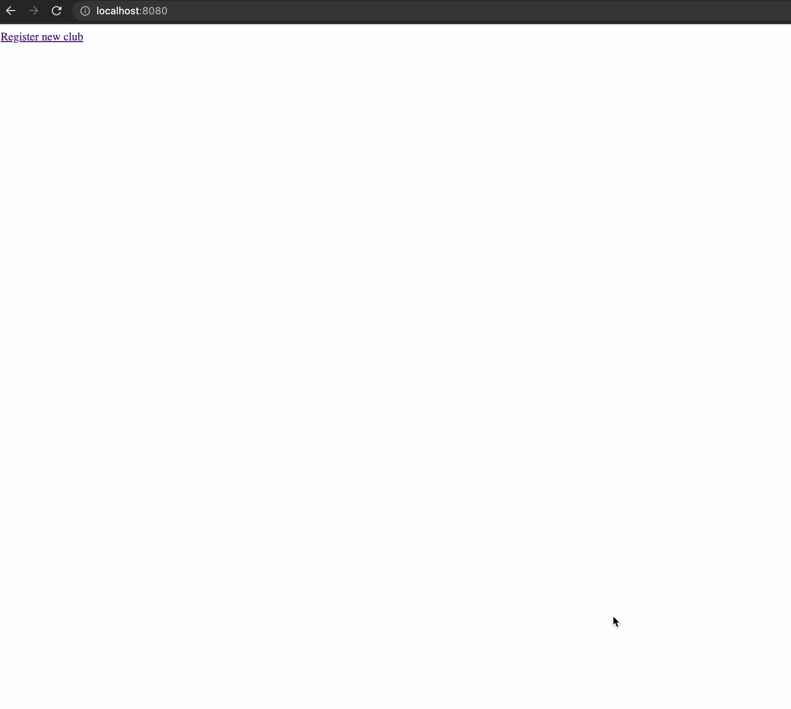

React + Play application
==================

## Description

An example app using React, Play Framework 2.8, Slick 5 and Akka stream to manage members of clubs

1. Install [Java JDK 11](https://adoptopenjdk.net/).
2. Install [SBT](http://www.scala-sbt.org/download.html)
3. Install [NodeJS](https://nodejs.org/en)   
4. Run `sbt ~run` for continuous recompilation of the server app.
5. Run `npm run dev` for continuous recompilation of the client app.

To see the webapp: [http://localhost:8080/](http://localhost:8080/)

## Demo
